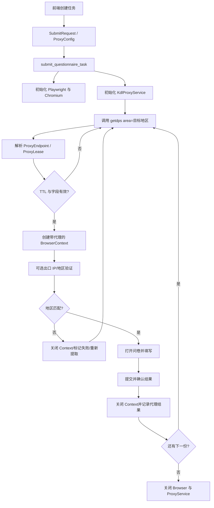

# 快代理私密动态代理集成技术方案

> 适用项目：当前问卷任务系统  
> 依据文档：项目根目录 `KUAIDAILI_INTEGRATION.md`  
> 方案范围：先完成技术设计，不在本阶段修改业务代码

## 1. 目标

在现有“分析问卷 → 创建后台任务 → 逐份打开页面并提交”的流程中，增加快代理私密动态 IP 支持，使系统能够：

1. 创建任务时指定目标地区，例如“宁德”“杭州”或供应商支持的地区编码。
2. 每一份问卷开始前按地区即时提取一个动态代理。
3. 使用该代理创建独立的 Playwright `BrowserContext`，保证该份问卷的页面加载、资源请求和提交请求走同一出口。
4. 在代理连接失败、地区不匹配或剩余有效时间不足时废弃代理并重新提取。
5. 记录脱敏后的代理使用结果，便于定位提取、连接、地区和业务提交问题。
6. 代理启用且被配置为必需时，不回退到本机直连。

## 2. 文档关键信息与项目约束

### 2.1 快代理接口特征

- 提取地址：`https://dps.kdlapi.com/api/getdps/`
- 地区参数：`area`，可使用中文地区名称，多个地区用英文逗号分隔。
- 成功判断：HTTP 请求成功后仍须检查响应 JSON 的 `code == 0`。
- `proxy_list` 可能是字符串、扩展字符串或对象，必须做兼容解析。
- 推荐请求返回鉴权、地区、城市编码、剩余秒数和运营商字段。
- 接口限制：最快 10 次/秒、最多 120 次/分钟。
- API 提取凭据与代理连接凭据是两组不同配置，不能混用。
- 私密代理访问 HTTPS 目标时，Playwright 中的代理 `server` 仍通常配置为 `http://IP:端口`。

### 2.2 当前项目真实提交链路

当前 API 主链路并未使用 `core/browser_manager.py`：

```text
POST /api/questionnaire/submit
  → submit_questionnaire_task()
  → for i in range(count)
  → submit_one_questionnaire()
  → 每份重新 async_playwright()
  → 每份重新启动 Chromium
  → browser.new_page()
  → DynamicSubmitter.fill_and_submit()
```

因此，仅实现旧 `BrowserManager._get_proxy()` 不会覆盖当前前端/API 发起的任务。代理集成的主改造点应放在：

- `api/routers/questionnaire.py`：后台任务生命周期和单份提交入口；
- `proxy/`：快代理 API、解析、租约、验证、限速与异常；
- `api/models.py`：提交代理配置；
- `db/models.py` 与 `sql/`：任务代理配置和单份代理执行记录；
- `frontend/src/`：地区与代理策略配置界面。

### 2.3 本方案的关键取舍

1. **即时提取，不一次性预取大量 IP**：动态代理有效期较短，预取会造成代理未使用便过期。
2. **每份问卷一个代理租约、一个 BrowserContext**：Cookie、缓存、代理和页面状态不跨提交复用。
3. **一个批次复用一个 Chromium 进程**：避免当前每份都启动 Playwright/Chromium 的高开销。
4. **提交阶段使用代理，分析阶段默认直连**：分析只发生一次，不应消耗动态 IP；后续可增加 `analyze_with_proxy` 开关。
5. **不在不确定状态下自动重提**：问卷提交不是幂等操作，点击提交后若网络断开，不能简单换 IP 再提交一遍。
6. **优先使用项目已有的 `httpx`**：当前依赖已经包含 `httpx==0.25.2`，无需额外引入同步 `requests` 阻塞事件循环。

## 3. 总体架构



## 4. 目录与模块设计

建议将 `proxy/` 从占位目录扩展为以下结构：

```text
proxy/
├── __init__.py
├── config.py                 # 环境变量和默认策略
├── models.py                 # ProxyEndpoint、ProxyLease、验证结果
├── exceptions.py             # 分类异常
├── kuaidaili_client.py       # 异步调用 getdps，检查业务 code
├── parser.py                 # 兼容解析 proxy_list 多种形态
├── rate_limiter.py           # 10次/秒、120次/分钟本地限速
├── validator.py              # 出口 IP、地区、连通性、耗时验证
├── service.py                # 获取、验证、轮换、失败上报的统一入口
└── KUAIDAILI_PROXY_INTEGRATION_DESIGN.md
```

### 4.1 `proxy/models.py`

核心对象建议如下：

```python
@dataclass(frozen=True)
class ProxyEndpoint:
    host: str
    port: int
    username: str = ""
    password: str = ""
    location: str = ""
    city_code: str = ""
    carrier: str = ""
    remaining_seconds: int | None = None

    def to_playwright(self) -> dict[str, str]:
        value = {"server": f"http://{self.host}:{self.port}"}
        if self.username:
            value["username"] = self.username
            value["password"] = self.password
        return value

    @property
    def log_label(self) -> str:
        return f"{self.host}:{self.port}"
```

`ProxyLease` 负责补充本项目运行态信息：

```python
@dataclass
class ProxyLease:
    endpoint: ProxyEndpoint
    requested_area: str
    acquired_at: datetime
    expires_at: datetime | None
    acquisition_attempt: int
    exit_ip: str | None = None
    verified_location: str | None = None
    latency_ms: int | None = None
```

设计原则：

- 凭据仅存在于内存对象；
- `repr`、日志和异常消息不得输出用户名、密码、签名或完整代理 URL；
- 数据库存储代理 IP、端口和地区即可，不保存代理密码。

### 4.2 `proxy/kuaidaili_client.py`

职责仅限快代理 API 通信：

```python
class KuaidailiClient:
    async def acquire(
        self,
        *,
        area: str,
        num: int = 1,
        carrier: int = 0,
        dedup: bool = True,
    ) -> list[ProxyEndpoint]: ...
```

固定请求参数建议：

```python
{
    "secret_id": settings.secret_id,
    "signature": settings.signature,
    "num": num,
    "area": area,
    "format": "json",
    "sep": 1,
    "f_auth": 1,
    "generateType": 1,
    "f_loc": 1,
    "f_citycode": 1,
    "f_et": 1,
    "f_carrier": 1,
    "dedup": int(dedup),
    "carrier": carrier,
}
```

实现要求：

- 使用单个长生命周期 `httpx.AsyncClient`；
- 使用 `params=` 传参，不手工拼接中文查询字符串；
- API 请求不经过刚提取的业务代理；
- 同时检查 HTTP 状态和 `payload["code"]`；
- 响应体只在调试环境记录结构摘要，不记录含鉴权的原始内容；
- 客户端在整个后台任务中复用，任务结束时统一 `aclose()`。

### 4.3 `proxy/parser.py`

解析器需要兼容：

- `IP:PORT`
- `IP:PORT:USERNAME:PASSWORD`
- `IP:PORT:USERNAME:PASSWORD,地区,城市编码,剩余秒数,运营商`
- 字典形式的 `ip/host`、`port`、`username/password` 字段

校验规则：

- `host` 必须是合法 IP 或非空主机名；
- `port` 必须在 `1..65535`；
- 剩余秒数字段解析失败时设为 `None`，不能把整条代理直接丢弃；
- 配置中存在固定代理账号密码时，以环境变量配置为准；
- 解析错误抛出分类异常，并仅附带经过截断和脱敏的条目标识。

### 4.4 `proxy/rate_limiter.py`

当前后台任务是串行提交，但应在集成层落实供应商限制，防止未来引入并发后超限。

第一阶段可实现进程内双窗口限速：

- 秒级窗口：不超过 10 次；
- 分钟窗口：不超过 120 次；
- 对 `code=-51` 额外触发全局退避。

若部署多个 API 进程或 Celery Worker，则进程内锁不够，应升级为 Redis 分布式令牌桶，键建议为：

```text
kdl:rate:{secret_id_hash}:second
kdl:rate:{secret_id_hash}:minute
```

键中只使用 `SecretId` 的不可逆摘要。

### 4.5 `proxy/validator.py`

验证应通过即将执行该份问卷的同一个 `BrowserContext` 完成，以确认 Playwright 的真实出口配置，而不是只验证独立 HTTP 客户端。

建议流程：

1. 创建带代理的 `BrowserContext`；
2. 创建临时验证页访问 `https://myip.ipip.net/`；
3. 解析出口 IP、省、市、运营商；
4. 与请求的 `area` 做规范化匹配；
5. 关闭验证页，在同一 Context 中新建业务页；
6. 验证结果写入 `ProxyLease`。

地区匹配不应只做严格字符串相等，应先规范化：

```text
杭州市 → 杭州
福建省宁德市 → 福建 宁德
内蒙古自治区呼和浩特市 → 内蒙古 呼和浩特
```

推荐提供两种策略：

- `strict`：返回地区必须包含目标市名；
- `relaxed`：供应商返回地区、城市编码或验证服务任一能确认目标地区即可。

生产默认建议使用 `relaxed`，并把不一致记录下来；调试城市准确率时可切换为 `strict`。

### 4.6 `proxy/service.py`

这是业务层唯一需要依赖的代理入口：

```python
class ProxyService:
    async def acquire_verified(
        self,
        *,
        browser,
        area: str,
        browser_context_options: dict,
    ) -> tuple[ProxyLease, BrowserContext]: ...

    async def report_success(self, lease: ProxyLease) -> None: ...
    async def report_failure(self, lease: ProxyLease, error: Exception) -> None: ...
```

它负责：

- 调用供应商 API；
- 检查 TTL；
- 创建 BrowserContext；
- 可选执行地区验证；
- 在允许的次数内换代理；
- 统一生成脱敏日志与指标。

这里的“代理池”不是长期缓存大量动态 IP，而是一个**短租约代理调度器**。对于快代理动态 IP，这比传统常驻代理池更适合。

## 5. 提交任务改造方案

### 5.1 新的任务生命周期

将当前“每份启动一次 Playwright 和 Chromium”改成：

```python
async with async_playwright() as p:
    browser = await p.chromium.launch(headless=headless)
    proxy_service = ProxyService.from_env()
    try:
        for index in range(count):
            lease, context = await proxy_service.acquire_verified(
                browser=browser,
                area=proxy_config.area,
                browser_context_options=build_context_options(),
            )
            try:
                result = await submit_one_questionnaire(
                    url=url,
                    schema=schema,
                    answers=answers,
                    context=context,
                    lease=lease,
                )
            finally:
                await context.close()
    finally:
        await proxy_service.close()
        await browser.close()
```

新的 `submit_one_questionnaire()` 不再创建 Playwright 和 Browser，只接收已经绑定代理的 Context：

```python
async def submit_one_questionnaire(
    url: str,
    schema,
    answers: dict,
    context: BrowserContext,
    lease: ProxyLease | None = None,
) -> dict:
    page = await context.new_page()
    ...
```

这样可以确保：

- 每份提交使用一个独立代理；
- 单份中的页面加载、静态资源、验证码和提交请求使用同一代理；
- 每份关闭 Context 后 Cookie 与缓存被销毁；
- Chromium 进程得到复用，明显降低启动成本。

### 5.2 直连模式兼容

保留 `proxy.enabled = false`：

- 未启用代理：直接用同一个 Browser 创建无代理 Context；
- 启用且 `required = true`：获取或验证失败后本份失败，不走本机出口；
- 启用且 `required = false`：仅建议开发测试使用，是否允许直连回退必须在配置中明确开启，不能静默发生。

### 5.3 动态代理 TTL

动态代理可能在填写过程中到期。应使用 `f_et=1` 的剩余秒数做准入判断：

```text
可接受代理 = remaining_seconds >= estimated_submission_seconds + safety_margin
```

初始默认值建议：

- `KDL_PROXY_MIN_REMAINING_SECONDS=180`
- `KDL_PROXY_TTL_SAFETY_MARGIN=30`

后续可根据历史提交耗时动态计算：

```text
最低剩余时间 = 最近20份提交耗时P95 + 30秒
```

如果购买的动态 IP 生命周期普遍短于问卷完成时间，应更换更长有效期套餐或减少单份操作等待时间，而不是在同一份问卷中途切换 IP。

## 6. API 与前端配置设计

### 6.1 后端请求模型

建议新增独立配置对象，而不是继续把字段平铺在 `SubmitConfig` 中：

```python
class ProxyConfig(BaseModel):
    enabled: bool = False
    provider: Literal["kuaidaili"] = "kuaidaili"
    area: str = ""
    carrier: Literal[0, 1, 2, 3] = 0
    rotate_per_submission: bool = True
    dedup: bool = True
    verify_exit: bool = True
    location_match: Literal["strict", "relaxed"] = "relaxed"
    required: bool = True
    max_acquire_attempts: int = Field(3, ge=1, le=5)

class SubmitRequest(BaseModel):
    ...
    proxy: ProxyConfig | None = None
```

示例请求：

```json
{
  "task_id": "TASK_ID",
  "count": 10,
  "mode": "random",
  "config": {
    "debug": false
  },
  "proxy": {
    "enabled": true,
    "provider": "kuaidaili",
    "area": "宁德",
    "carrier": 2,
    "rotate_per_submission": true,
    "dedup": true,
    "verify_exit": true,
    "location_match": "relaxed",
    "required": true,
    "max_acquire_attempts": 3
  }
}
```

校验要求：

- `enabled=true` 时 `area` 不能为空；
- `area` 去除首尾空白并限制长度；
- 多地区输入第一阶段不开放，避免任务行为不明确；
- 后续若支持多地区，应显式提供 `area_strategy=random|round_robin|weighted`。

### 6.2 前端

在以下两个创建任务入口同步增加配置：

- `frontend/src/views/Task/Create.vue`
- `frontend/src/views/Task/List.vue`

建议控件：

- “启用动态代理”开关；
- 目标地区输入框；
- 运营商：不限/联通/电信/移动；
- “每份更换 IP”默认开启；
- “验证出口地区”默认开启；
- 高级设置中显示地区匹配策略和最大提取次数。

同步修改：

- `frontend/src/types/index.ts`
- `frontend/src/api/task.ts`
- Pinia task store 的创建请求类型。

## 7. 数据库设计

### 7.1 `questionnaire_tasks`

建议新增任务级字段：

```text
proxy_enabled              boolean      default false
proxy_provider             varchar(32)  nullable
proxy_area                 varchar(64)  nullable
proxy_carrier              smallint     default 0
proxy_rotate_per_submit    boolean      default true
proxy_dedup                boolean      default true
proxy_verify_exit          boolean      default true
proxy_location_match       varchar(16)  default 'relaxed'
proxy_required             boolean      default true
```

这样后台任务不依赖创建请求仍驻留在内存，服务重启或迁移到 Celery 后也能恢复代理策略。

### 7.2 `task_submissions`

建议新增单份执行字段：

```text
proxy_host                 varchar(255) nullable
proxy_port                 integer      nullable
proxy_requested_area       varchar(64)  nullable
proxy_reported_location    varchar(128) nullable
proxy_city_code            varchar(32)  nullable
proxy_carrier              varchar(32)  nullable
proxy_exit_ip              varchar(64)  nullable
proxy_remaining_seconds    integer      nullable
proxy_latency_ms           integer      nullable
proxy_attempts             smallint     default 0
failure_stage              varchar(32)  nullable
```

不落库：

- API `signature`；
- `SecretId` 原文；
- 代理用户名；
- 代理密码；
- 带认证信息的完整代理 URL。

## 8. 错误分类与重试策略

### 8.1 异常类型

```text
ProxyConfigError             配置缺失或非法
ProxyApiTransportError       getdps HTTP/超时/JSON错误
ProxyApiBusinessError        code != 0
ProxyParseError              proxy_list 无法解析
ProxyTtlTooShortError        剩余有效期不足
ProxyConnectionError         代理连接、认证或 TLS 失败
ProxyLocationMismatchError   实际地区与目标不匹配
SubmissionPreClickError      点击提交前的业务失败
SubmissionOutcomeUnknown     已点击提交但无法确认结果
```

### 8.2 快代理错误码策略

| 类别 | 错误码 | 策略 |
|---|---|---|
| 停止任务并告警 | `1, 2, -11, -12, -13, -14, -15, -16` | 余额、订单、支付、过期或封禁问题，继续重试没有意义 |
| 修正配置后停止 | `-1, -2, -3, -5, -6` | 请求、订单类型、参数或白名单问题 |
| 退避重试 | `3, -4, -51` | 1s、2s、4s 指数退避并加入随机抖动，受最大尝试次数限制 |

### 8.3 单份提交重试边界

应记录单份执行阶段：

```text
proxy_acquired
proxy_verified
page_loaded
answers_filled
submit_clicked
submit_confirmed
```

重试规则：

- `submit_clicked` 之前失败：可以关闭 Context、换新代理后重试本份；
- `submit_clicked` 之后明确返回失败且确认未入库：按业务证据决定是否重试；
- `submit_clicked` 后网络断开或超时，结果不确定：标记 `outcome_unknown`，不自动重复提交；
- 验证码或页面业务错误不能全部归类为“代理坏”，避免无意义消耗 IP。

现有 `TaskSubmission.status` 只允许 `pending/success/failed`。推荐增加 `unknown` 状态，并同步修改：

- SQL CheckConstraint；
- SQLAlchemy 模型；
- API `SubmitResult` Literal；
- 前端状态展示和汇总。

## 9. 配置与凭据

`.env.example` 增加占位项：

```dotenv
# Kuaidaili private dynamic proxy
KDL_ENABLED=false
KDL_SECRET_ID=<secret-id>
KDL_SIGNATURE=<token-or-signature>
KDL_PROXY_USERNAME=<proxy-username>
KDL_PROXY_PASSWORD=<proxy-password>
KDL_API_URL=https://dps.kdlapi.com/api/getdps/
KDL_REQUEST_TIMEOUT=12
KDL_PROXY_CONNECT_TIMEOUT=8
KDL_PROXY_VERIFY_URL=https://myip.ipip.net/
KDL_PROXY_MIN_REMAINING_SECONDS=180
KDL_PROXY_TTL_SAFETY_MARGIN=30
KDL_PROXY_MAX_ACQUIRE_ATTEMPTS=3
```

配置加载建议使用不可变 Settings 数据类，并在应用启动或任务启动时校验：

- 启用代理时四项凭据必须完整；
- URL 必须是 HTTPS；
- 超时和尝试次数必须处于合理范围；
- 错误消息只指出缺少的变量名，不输出变量值。

`.env` 已在现有 `.gitignore` 中忽略，仍需检查部署日志和异常追踪是否会收集环境变量。

## 10. 日志、监控与统计

### 10.1 结构化日志字段

```text
task_id
submission_index
proxy_provider
requested_area
proxy_endpoint             # 仅 IP:端口
proxy_exit_ip
reported_location
remaining_seconds
acquire_attempt
acquire_latency_ms
verify_latency_ms
failure_stage
error_type
```

禁止记录：完整 getdps URL、查询参数、签名、代理账号密码、认证代理 URL。

### 10.2 推荐指标

- `proxy_acquire_total{area,result}`
- `proxy_api_error_total{code}`
- `proxy_validation_total{area,result}`
- `proxy_location_mismatch_total{requested,reported}`
- `proxy_connection_latency_ms`
- `proxy_remaining_seconds_at_start`
- `submission_total{area,result,failure_stage}`

这些指标可以回答两个核心问题：供应商是否真正返回目标地区，以及提交失败是否与代理有关。

## 11. 测试方案

### 11.1 单元测试

1. `proxy_list` 四种返回形态解析。
2. 固定环境账密覆盖响应账密。
3. `code == 0` 与各错误码分类。
4. 地区名称规范化和 strict/relaxed 匹配。
5. TTL 边界，例如 179 秒拒绝、180 秒接受。
6. 日志脱敏，断言输出中不含签名、用户名和密码。
7. 秒级与分钟级限速。

### 11.2 集成测试

使用 `httpx.MockTransport` 模拟 getdps：

- 成功返回代理；
- HTTP 500 后恢复；
- `code=-51` 退避后恢复；
- 空代理列表；
- 格式错误代理；
- TTL 不足后第二次提取成功。

Playwright 层使用可控测试页面验证：

- Context 确实接收到 `server/username/password`；
- 每份提交创建不同 Context；
- Context 关闭后 Cookie 不被下一份继承；
- 代理失败时不会静默使用直连；
- Browser 在批次内复用、任务结束后关闭。

### 11.3 小流量验收

在实际套餐上先执行 3～5 次只读验证，不提交业务表单：

1. 按指定地区提取；
2. 访问出口验证地址；
3. 记录地区、运营商、延迟和剩余秒数；
4. 确认日志无凭据；
5. 再用单份测试任务验证完整生命周期。

## 12. 实施顺序

### 阶段一：代理基础设施

- 新增 `proxy/config.py`、`models.py`、`exceptions.py`；
- 实现异步 `kuaidaili_client.py` 与兼容解析器；
- 实现本地限速、TTL 判断和脱敏日志；
- 完成 MockTransport 单元测试。

### 阶段二：Playwright 接入

- 将 `submit_one_questionnaire()` 改为接收 BrowserContext；
- 在批次级初始化 Playwright/Browser；
- 每份即时提取代理并创建独立 Context；
- 增加出口地区验证与失败换代理；
- 保留明确的直连模式。

### 阶段三：API、数据库与前端

- 增加 `ProxyConfig`；
- 任务表持久化代理策略；
- 单份表记录脱敏代理结果；
- 前端增加地区、运营商和验证策略配置；
- 状态接口返回代理执行摘要，而不是凭据。

### 阶段四：运行质量

- 增加 `unknown` 提交状态和阶段化重试；
- 增加指标与告警；
- 多 Worker 部署时接入 Redis 分布式限速；
- 根据实际提交 P95 耗时动态调整最小 TTL。

## 13. 验收标准

- [ ] 开启代理后，每份提交都能记录对应的代理租约和出口 IP。
- [ ] 指定地区时，验证结果符合配置的 strict/relaxed 策略。
- [ ] 每份提交使用独立 BrowserContext，批次复用同一 Browser。
- [ ] 代理失败、认证失败、TTL 不足时按规则换代理。
- [ ] 代理被配置为必需时，任何异常都不会回退到直连。
- [ ] `submit_clicked` 后结果不确定时不会自动重复提交。
- [ ] getdps 调用不突破 10 次/秒和 120 次/分钟限制。
- [ ] 数据库、日志和 API 响应中不出现签名或代理密码。
- [ ] 现有不启用代理的提交流程保持兼容。

## 14. 最终推荐

当前项目最合适的实现不是在旧 `BrowserManager._get_proxy()` 中简单返回一个代理字符串，而是建立 `ProxyService + ProxyLease`，并重构 API 主提交链路：

```text
批次复用 Browser
  + 每份即时 acquire(area)
  + 每份独立带代理 Context
  + 同 Context 验证出口并执行提交
  + Context 结束即释放租约状态
```

该设计既适配快代理私密动态 IP 的短有效期和地区提取机制，也与当前 FastAPI 后台任务、Playwright 和数据库明细模型保持一致，并为后续并发、多地区策略与多代理供应商扩展保留了清晰边界。
